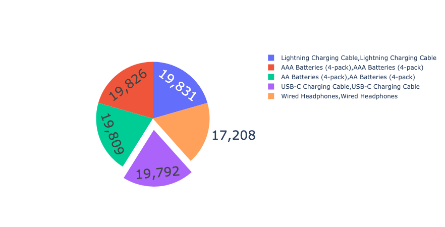

# Sales Data Analysis



## Overview
This repository contains Python code for conducting exploratory data analysis (EDA) on sales data. The code covers tasks such as merging multiple months of sales data into a single CSV file, data cleaning and formatting, visualizing sales trends, identifying the best-selling products, determining optimal advertisement times, and discovering frequently co-purchased items.

## Requirements
- Python 3.x
- Pandas
- Matplotlib
- Seaborn
- Plotly

## Usage

1. Clone the repository to your local machine:
   ```bash
   git clone https://github.com/shreeramdrao/Exploratory-Data-Analysis-On-Sales.git

2. Navigate to the project directory:
   ```bash
   cd Exploratory-Data-Analysis-On-Sales

3. Install the required libraries (if not already installed):
   ```bash
   pip install -r requirements.txt

4. Run the Python scripts in a Jupyter Notebook or any Python IDE to perform the following tasks:

    1. **Merging Sales Data:** Combine sales data from multiple CSV files into a single file for analysis.
  
    3. **Data Cleaning and Formatting:** Handle missing values, format columns, and prepare data for analysis.

    4. **Visualizing Sales Trends:** Generate plots and charts to visualize sales trends over time.
    
    5. **Identifying Best-Selling Products:** Determine which products sold the most and analyze their prices.
    
    6. **Optimal Advertisement Time:** Analyze order timestamps to identify the best time for product advertisements.
    
    7. **Frequently Co-Purchased Items:** Explore patterns of products frequently purchased together.

## Files
`merge_sales_data.py`: Python script to merge 12 months of sales data into a single CSV file.

`clean_and_format_data.py`: Python script for data cleaning and formatting tasks.

`visualize_sales_trends.py`: Python script to visualize sales trends using Matplotlib, Seaborn, and Plotly.

`best_selling_products.py`: Python script to identify and analyze best-selling products.

`optimal_advertisement_time.py`: Python script to determine the optimal time for product advertisements.

`frequently_purchased_items.py`: Python script to discover frequently co-purchased items.

## License

This project is licensed under the MIT License - see the LICENSE file for details.


